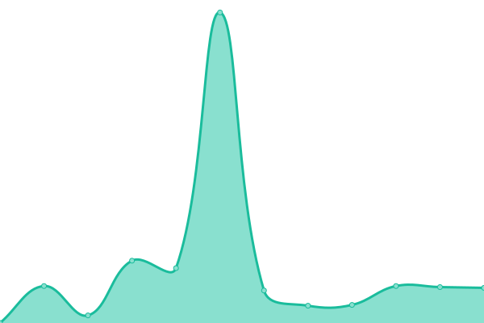

# Marco Madera Status

Web version: [status.marcomadera.com](https://status.marcomadera.com)

<!--start: status pages-->
<!-- This summary is generated by Upptime (https://github.com/upptime/upptime) -->
<!-- Do not edit this manually, your changes will be overwritten -->
<!-- prettier-ignore -->
| URL | Status | History | Response Time | Uptime |
| --- | ------ | ------- | ------------- | ------ |
|  [Marco Madera](https://marcomadera.com) | 🟩 Up | [marco-madera.yml](https://github.com/MarcoMadera/status/commits/HEAD/history/marco-madera.yml) | 

 152ms
     
 | 

<a href="https://status.marcomadera.com/history/marco-madera">100.00%</a>
    

|  [Rindu](https://rindu.marcomadera.com) | 🟩 Up | [rindu.yml](https://github.com/MarcoMadera/status/commits/HEAD/history/rindu.yml) | 

 1437ms
     
 | 

<a href="https://status.marcomadera.com/history/rindu">100.00%</a>
    

|  [Dashboard](https://dashboard.marcomadera.com) | 🟩 Up | [dashboard.yml](https://github.com/MarcoMadera/status/commits/HEAD/history/dashboard.yml) | 

 153ms
     
 | 

<a href="https://status.marcomadera.com/history/dashboard">100.00%</a>
    

|  [Authentication](https://auth.marcomadera.com) | 🟩 Up | [authentication.yml](https://github.com/MarcoMadera/status/commits/HEAD/history/authentication.yml) | 

 338ms
     
 | 

<a href="https://status.marcomadera.com/history/authentication">100.00%</a>
    

|  [Rindu Coverage](https://coverage.rindu.marcomadera.com) | 🟩 Up | [rindu-coverage.yml](https://github.com/MarcoMadera/status/commits/HEAD/history/rindu-coverage.yml) | 

 120ms
     
 | 

<a href="https://status.marcomadera.com/history/rindu-coverage">100.00%</a>
    

|  [Base API](https://api.marcomadera.com) | 🟩 Up | [base-api.yml](https://github.com/MarcoMadera/status/commits/HEAD/history/base-api.yml) | 

 143ms
     
 | 

<a href="https://status.marcomadera.com/history/base-api">100.00%</a>
    

|  [Lyrics API](https://api.marcomadera.com/synced-lyrics) | 🟩 Up | [lyrics-api.yml](https://github.com/MarcoMadera/status/commits/HEAD/history/lyrics-api.yml) | 

 877ms
     
 | 

<a href="https://status.marcomadera.com/history/lyrics-api">100.00%</a>
    

<!--end: status pages-->
